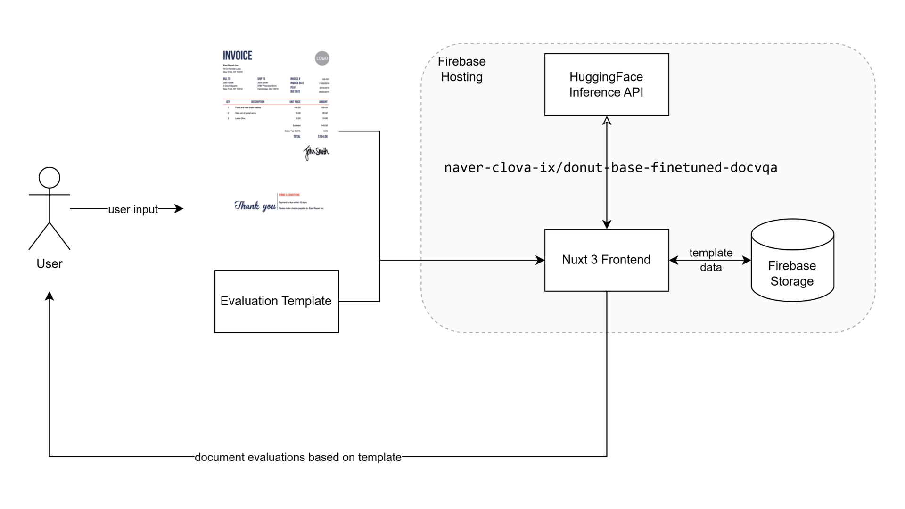
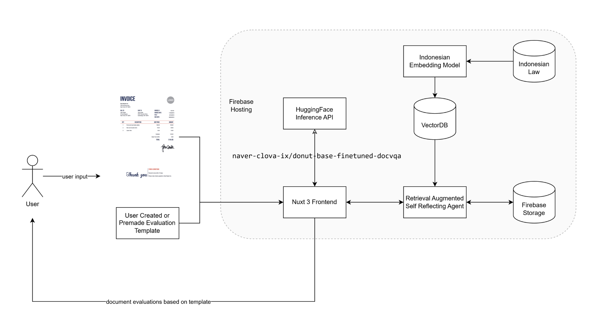

# CheckMy: Collaborative, AI Collaborative Document Checker 
This project is made for GarudaHacks 5.0

The main goal of this project is: to create a web application to ease the process of validating legal document (or any documents) in order to help minimize any legal when doing any actions.

This goal is mainly motivated to help any person from any socio-economic level understand legal documents before committing to jobs, a joint-venture of business, or even other simple tasks.

To achieve this we provide solution with the following specification:
1. It needs to be private (not yet implemented)
2. It needs to be collaborative
3. It needs to be able to leverage llms

The overall flow of the application are as follows:
&nbsp;

The current implementation uses technologies as the following:
1. Firebase Hosting and Storage to store templates
2. Nuxt 3 as frontend Framework
3. HuggingFace inference API

&nbsp;